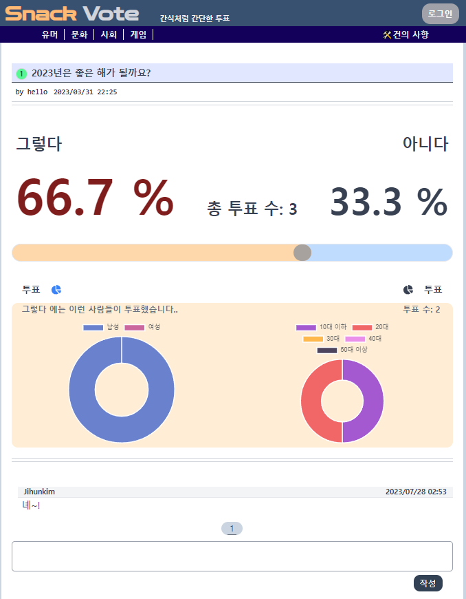
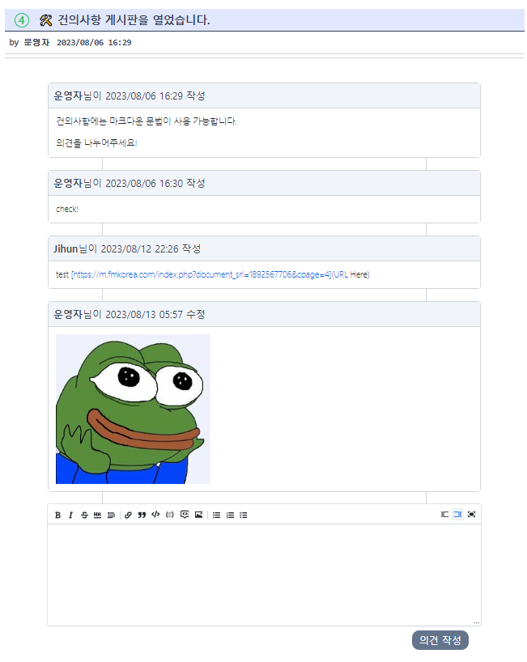
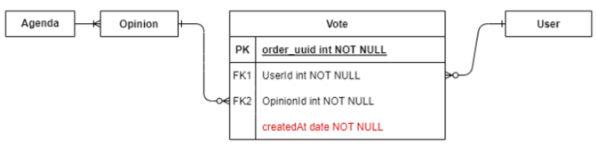
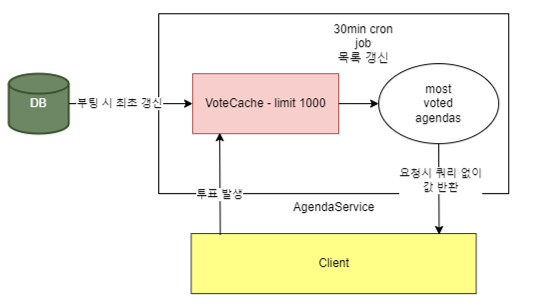
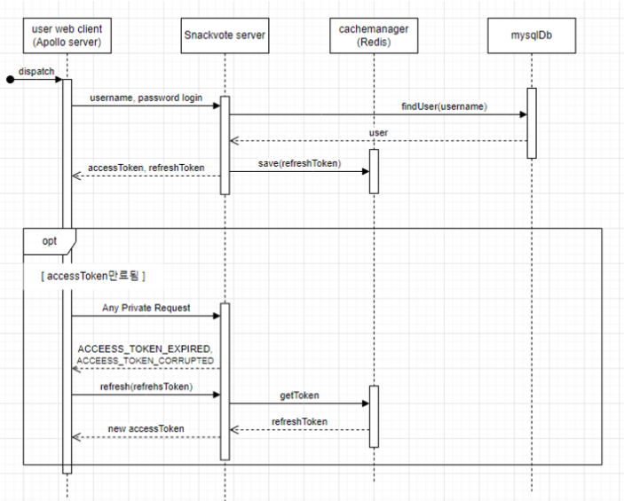

# Snack-Vote

vote for everyone, every agenda

# 개발 동기

사람들은 남의 의견을 듣기를 참 좋아합니다.

커뮤니티에 투표기능이 있는 곳은 많지만, 투표기능이 메인이 되는 커뮤니티는 없는 것 같아

간단한 형태의 투표를 메인에 노출시키며 매일 여론을 확인할 수 있는 커뮤니티를 만들어 보았습니다.

# 사용 기술

backend - NestJS, TypeOrm, graphql

frontend - reactJS, graphql, typescript

DB - RDS for mysql

deploy - docker-stack, aws-EC2, Route53

<https://snackvote.org> 에서 2023년 동안 운영하다 중단되었습니다.

# 주요 구현사항

- refresh token, role 기반 인증

- google OAuth2.0 login

- 이진 투표 안건 작성 및 투표 기능, 투표 인원의 성별, 나이에 관한 통계 제공

- 투표 게시글에 대한 댓글, 대댓글 CRUD

- 투표 검색 및 작성글, 댓글 조회

- 최근 최다 투표 발생 안건 메인 표시

- markdown 활용 issue(건의사항) 게시판

- nginx 컨테이너를 이용한 https certification

 

# 프로젝트 아키텍처

### ERD

### 배포 Architecture

 

# Preview

  

  

---

# 주요 구현사항

- ## 인기 글 추출 기능

  개발 초기 모델 인기 글 추출 방법은 최근 n일 내의 게시글 중 최다 득표를 받은 게시글로 선정했었습니다.

  그러나 최근 글 이외에는 가져올 수 없어 지난 글이 재조명 된 경우 화면에 표시해줄 수 없고, 사용자 관점에서 인기 글이라는 관점에 잘 부합하지 않는다 생각했습니다.

  - 1차 수정 : 투표 일자를 기준으로 집계하기 위해 생성일자 포함한 vote 스키마 추가 및 이를 이용한 집계 로직 작성

    

  - 2차 수정 : 요청마다 큰 쿼리를 수행해 집계하는 것을 막기 위해, 실시간 투표를 캐싱하고
    일정 시간마다 집계 결과 갱신. 요청에 대해선 쿼리 없이 저장 값 반환함.

    

- ## Refresh token 기반 인증

    

  - refresh token 저장소로 Cache manager를 사용함으로 서버 측에서 TTL을 설정해 token 만료 시 자동으로 제거됨.
  - 토큰 만료 시 서버에서 특정 타입의 에러를 반환하고, 클라이언트의 apollo 서버가 이 에러 응답을 받으면 자동으로 refresh 요청을 보내 토큰을 재설정함.

- ## Google OAuth2.0 login

  google OAuth를 이용한 로그인을 구현했습니다. 초기엔 일반적인 redirect url을 사용한 OAuth를 사용하려 했으나, 별도의 api 권한은 필요하지 않고 오직 사용자 profile 정보만을 필요로 하기에 더 간소화된 *Google 계정으로 Login*을 사용했습니다.

  

  google로부터 받은 credential을 decode한 후 user를 찾는다면 `access token`을 반환하고, 그렇지 않는다면 `createRquired:true`를 반환합니다.

  그러한 경우 client 부분에서는 추가 정보 입력을 요구하는 페이지로 redirect됩니다.

- ## Github Actions 이용 CI/CD 개선

  github action을 이용해 main 브랜치에 push 혹은 pr이 일어날 때 테스트를 수행하고, commit message에서 version 태그를 감지해서 version<숫자>.<숫자> 일 때 docker server와 client 각각에서 해당 버전 태그의 이미지를 빌드해서 push하도록 했습니다.

  aws사이드에서는 업데이트된 stack.yaml 파일을 업로드하고 deploy를 실행하기만 하면 됩니다.

 

# 성능 테스트 및 개선

- 테스트 개요 : 게시글 상세 정보 페이지를 조회하는 상황을 가정합니다. 해당페이지는 해당 웹의 가장 메인이 되는 기능이 존재하는 페이지로, `1. 댓글 조회 요청`, `2. 게시글 투표 정보 조회 요청` 두 가지를 하나의 gql 쿼리로 묶어 요청합니다.

  특히 두 요청 중 2번 요청은 투표 정보 집계를 위해 5회의 조인이 존재하는 무거운 쿼리를 실행합니다.
  해당 gql 요청을 기준으로 시간당 가해지는 요청 수를 변경하며 성능을 측정합니다.

  또한, 해당 페이지의 특성상 응답받는 투표 데이터의 수에 크게 영향을 받을 것으로 예상되므로 투표 수 0건, 10000건에 대해 달리하여 테스트를 진행했습니다.

- 테스트 서버 구성 : EC2 Server + mysql RDS
- 테스트 툴 : k6 + influxDb + grafana

  k6 테스트 드라이버 서버 사양: EC2 t3.medium 2CPUs

  ### 초기 테스트

  - 테스트 1
    - Server : EC2 t2.medium 2vCPUs 4GB RAM
    - DB : AWS RDS DBm5.large 2vCPUs 8GB RAM
    - 최대 vUser : 50
    - 투표 데이터: 0개

  

  - 테스트 2
    - 투표 데이터: 10000개

  

   

  비교적 적은 vUser인 50대의 테스트에서도 무거운 sql 쿼리로 인해 상당히 늦은 속도를 보여주고, 투표 데이터가 10000 건으로 늘어난 경우 매우 느린 응답시간에 의해 대량의 timeout이 발생하는 것을 볼 수 있습니다.

  ### 개선 작업

  문제가 되는 것은 매 요청시 모든 투표 데이터를 가져오는 무거운 쿼리를 실행한다는 점입니다.

  그러나 실제로 집계 데이터에 투표 객체의 모든 데이터가 필요하지는 않습니다. 또한 게시글 특성상 투표 수가 많은 게시글은 더 자주 조회 될 것입니다. 이에 다음과 같이 수정했습니다.

  - 투표 객체들에서 집계 데이터만을 뽑아낸 데이터 객체 `AgendadetailsSummary` 정의.
  - 해당 객체를 LRU 캐시에 캐싱하여 캐시 미스 시에만 실제 DB에 접속 실행
  - 클라이언트의 투표 컴포넌트 렌더링, 서버의 응답등의 요청에 해당 데이터 객체 사용하도록 전면적 수정

  

  ### 개선 후 테스트

  - 테스트 1

    - 최대 vUser : 232
    - 투표 데이터 0건
    - 댓글요청 제외, 투표정보 단일요청

    

  - 테스트 2

    - 최대 vUser : 232
    - 투표 데이터 10000건
    - 댓글요청 제외, 투표정보 단일요청

    

    투표정보 단일요청에 대해 투표 수에 의한 영향이 크게 줄어들었으며,

    또한 매번 무거운 쿼리를 실행하지 않으므로 평균 요청시간, 95% 분위값 등 전반적인 성능이 50% 이상 향상되었습니다.

  - 테스트 3

    - 최대 vUser : 232
    - 투표 데이터 10000건
    - 댓글과 투표 데이터 모두 집계 (2 queries)

    

    댓글과 투표 데이터를 모두 가져오는 경우, vUser 232명에 대해서 95% 이상의 요청이 1.27초 이내에 실행되었습니다. 평균 응답시간은 약 0.7초입니다.

    또 추가적인 스트레스 테스트에 의해 vUser 850대 까지 응답 실패 없이 수행되는 것을 확인했습니다.

 

# 버그 수정 및 세부 수정 항목

- ## DB docker mysql image --> AWS RDS for MySQL

  초기엔 DB로 mysql docker image를 server와 같은 EC2 인스턴스에서 사용했는데, 다음과 같은 문제가 있었습니다.

  - 서버와 CPU 및 메모리를 공유하므로 성능의 저하
  - 컨테이너의 디스크 점유로 저장소 사용량 70~80% 대로 부담이었고, 이 문제로 서버가 다운되는 현상도 발생
  - 개발 관점에서 ec2 콘솔 or ssh -> mysql docker 컨테이너 접속의 이중 접속 구조로 불편함 (port를 통해 접속이 불가능)

  때문에 아키텍처에서 DB 부분을 서버 인스턴스와 분리하여 AWS RDS를 사용하게 되었습니다.

  - EC2 디스크 및 리소스 사용량 개선 및 서버 다운 문제 해결됨
  - yaml 파일 간소화
  - Mysql workbench를 통한 DB 접속 가능

- ## Client의 Refresh Token 관련 수정

  - client의 onError link가 refresh 동작 이후 재생성된 토큰을 바로 넘기지 않던 문제를 수정

    이전 요청을 나타내는 operation 객체에 기존 헤더가 그대로 적용되므로 재생성된 토큰을 헤더에 직접 넣어주는 동작이 필요했습니다.

  - access token이 만료된 경우 뿐만 아니라 토큰이 이상한 값으로 오염되는 경우에도 refresh 동작을 일으키도록 수정 및 Error Type `TOKEN_CORUPTED` 추가
